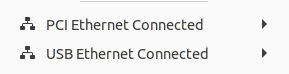
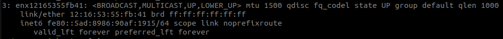
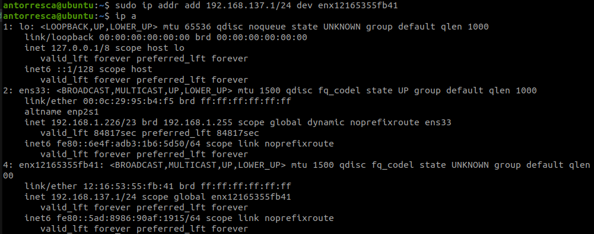
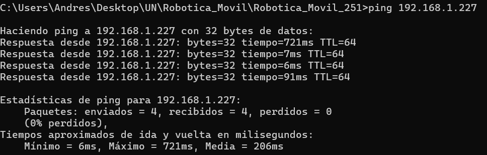
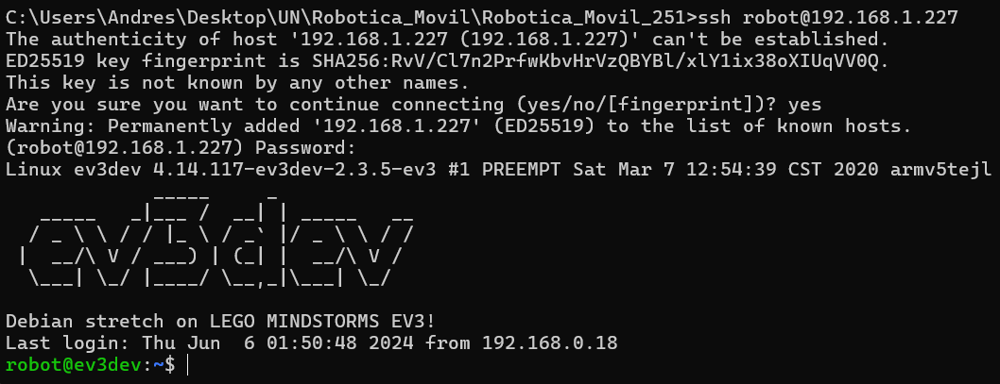
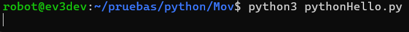

# 👾Laboratorio 1: Conociendo los robots Ev3 Y Kuboki

## 🏁Objetivos

* Familiarizarse con los robots Kuboki y EV3, explorando sus características, herramientas de desarroIlo, sensores. creando un programa simple para controlar los movimientos del robot.
* Modelador un robots movil en software de simulación.
* Crear un programa simple para controlar los movimientos del robot

## 🔄️Desarrollo

### Conexion por USB a Ubuntu





`sudo ip addr add 192.168.137.1/24 dev enx12165355fb41`

`sudo ip link set enx12165355fb41 up`









```python


# Pivot 30 degrees
tank_drive.turn_degrees(
    speed=SpeedPercent(25),
    target_angle=90
)#!/usr/bin/env python3

from time import sleep


from ev3dev2.motor import LargeMotor, OUTPUT_B,OUTPUT_C, SpeedPercent, MoveTank
from ev3dev2.sensor.lego import GyroSensor
from ev3dev2.sensor import INPUT_1
from ev3dev2.sensor.lego import UltrasonicSensor
from ev3dev2.led import Leds
from ev3dev2.sound import Sound

sound = Sound()
sound.speak('Houston here i go')
Leds().set_color("LEFT", "RED")
Leds().set_color("RIGHT", "RED")
sleep(2)
Leds().set_color("LEFT", "GREEN")
Leds().set_color("RIGHT", "GREEN")
sleep(2)
sensor = UltrasonicSensor(INPUT_1)
tank_drive = MoveTank(OUTPUT_B, OUTPUT_C)
while sensor.distance_centimeters > 5:
        tank_drive.on(SpeedPercent(25), SpeedPercent(25))
tank_drive.stop()

tank_drive.stop()
tank_drive.gyro = GyroSensor()

# Calibrate the gyro to eliminate drift, and to initialize the current angle as 0
tank_drive.gyro.calibrate()

# Pivot 30 degrees
tank_drive.turn_degrees(
    speed=SpeedPercent(25),
    target_angle=90
)
#+end_src

```
