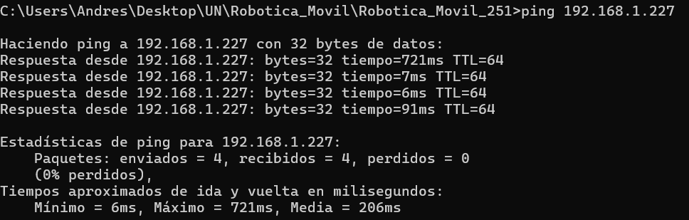
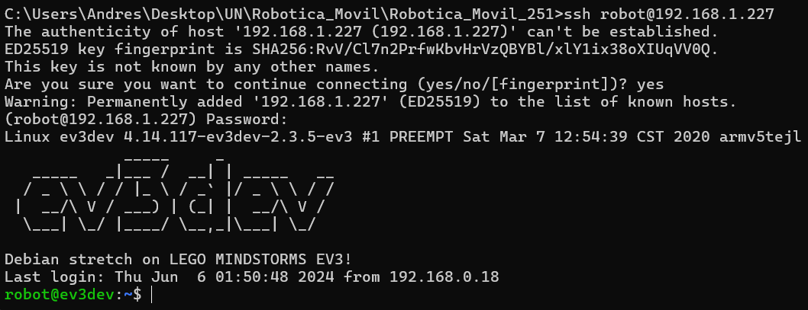
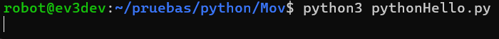
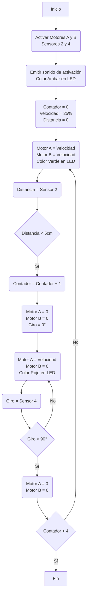

# 👾Laboratorio 1: Conociendo los robots Ev3 Y Kuboki

## 🏁Objetivos

* Familiarizarse con los robots Kuboki y EV3, explorando sus características, herramientas de desarroIlo, sensores. creando un programa simple para controlar los movimientos del robot.
* Modelador un robots movil en software de simulación.
* Crear un programa simple para controlar los movimientos del robot

## 🖌️Estado del Arte

### Que es un robot?

La norma ISO 8373:2021 define un robot como un sistema actuado mecánicamente, programable, con cierto grado de autonomía, que puede percibir su entorno y realizar acciones para alcanzar objetivos específicos. Esta definición reconoce tanto los robots industriales como los robots de servicio, para los cuales     se establece como característica general el tener la capacidad para tomar decisiones y ejecutar tareas sin control humano continuo.

El funcionamiento de un robot basa en cuatro elementos fundamentales. La locomoción le permite desplazarse, utilizando mecanismos como ruedas, orugas o patas, dependiendo del entorno. La percepción la cual le otorga la capacidad de captar y procesar información mediante sensores como cámaras, LIDAR o
ultrasonido. La localización es esencial para que el robot identifique su posición en un espacio determinado, utilizando GPS, mapas digitales o algoritmos de SLAM. Finalmente, la navegación integra todos estos elementos para planificar y ejecutar trayectorias seguras hacia sus objetivos, adaptándose a posibles
obstáculos o cambios en el entorno.

Estas capacidades permiten que los robots se apliquen en múltiples sectores. En la industria manufacturera, realizan tareas repetitivas y de precisión, como soldadura y ensamblaje. En logística, transportan y ordenan mercancía de forma autónoma. En salud, colaboran en cirugías, asistencia y rehabilitación. También destacan en agricultura, exploración espacial, rescate en zonas de riesgo y servicios domésticos como limpieza o vigilancia.

### LEGO Mindstorms EV3

El robot LEGO EV3 es una plataforma robótica que permite la integración de múltiples sensores y actuadores para programar, tareas o rutinas básicas o avanzadas, como estrategias de control, navegación autónoma hasta visión artificial si se le agregan periféricos como cámaras. Este robot tiene un sistema operático basado en Linux y cuenta con un procesador como el ARM9 de 300 MHz, adicional a esto, tiene puertos de comunicación USB, bluetooth y Wifi lo que lo vuelve versátil si se requiere el envío y la toma de datos de forma remota.

#### Sensores y Actuadores

* Sensor táctil : Detecta contacto físico (presionado / liberado)
* Sensor de color : Distingue colores (8 distintos), mide intensidad de luz reflejada y ambiental
* Sensor ultrasónico : Mide distancia a objetos (de 3 cm a 250 cm)
* Giroscópico : Detecta velocidad angular y orientación
* Motor grande con una velocidad angular entre los 160-170 rpm con un torque de rotación de 20 Ncm. Este motor incluye un sensor de rotacion incorporado con resolucion de 1 grado para el control de velocidad.
* Motor mediano con una velocidad de los 240 a 250 rpm y un torque de rotación de 8Ncm.

#### APIS

* EV3Dev API: Interfaz que permite acceso a sensores, motores, LEDs, botones, desde lenguajes estándar a través del sistema de archivos Linux.
* LEGO SPIKE API: API basada en MicroPython para los nuevos kits como SPIKE Prime (aunque limitada para EV3).
* leJOS API: API Java específica para NXT y EV3 con muchas clases orientadas a robótica.

#### Lenguajes de Programación

* Python: Vía EV3Dev o Pybricks
* Java: Mediante leJOS o EV3Dev.
* C/C++: Soportado en EV3Dev.
* Scratch / Blockly: Programación visual para estudiantes.
* LabVIEW (EV3-G) – Lenguaje gráfico usado en el software oficial LEGO Mindstorms.

### KOBUKI

Al igual que el robot LEGO EV3, el robot Kuoki también es una plataforma robótica que integra múltiples sensores, con la diferencia de que estos últimos son usados principalmente para la navegación y mapeo de entornos. El firmware está diseñado para funcionar con ROS, el cual ofrece paquete y controladores  que permiten la operacion dentro del entorno de ROS, lo que puede facilitar la implementacion de algoritmos para la navegacion, mapeo y control.

#### Sensores y Actuadores

* Sensores de colisión (bumpers): 3 interruptores mecánicos (izquierda, centro, derecha) para detectar impactos frontales.
* Sensores de cliff (precipicio): Detectan bordes o desniveles peligrosos para evitar caídas.
* Giroscopio digital: Mejora la estimación de orientación angular.
* Encoders de rueda: Para cálculo de odometría (posición y velocidad).
* Sensor de caída de ruedas (wheel drop): Detecta si una rueda pierde contacto con el suelo (útil para detectar levantamientos).
* Motores DC: El robot cuenta con motores DC tipo Brushed de un torque que puede llegar hasta un valor de 33mNm con una velocidad de 8800rpm.
* Altavoces: Actuador de audio para emitir sonidos o alertas y con el cual se puede usar varias secuencias de sonidos programables.

#### APIS

* Kobuki node API (ROS): Publica topics como odom, sensor_state, y ofrece servicios para emitir sonidos, controlar LEDs, y movimiento.
* ROS Navigation API: Utiliza la odometría de Kuboki con algoritmos de navegación y planificación de ROS.
* Gazebo plugins API: Para simular a Kuboki en entornos virtuales (uso con ROS y Gazebo).

#### Lenguajes de Programación

* Python: A través de rospy, usado comúnmente para scripts.
* C++: Vía roscpp, recomendado para tareas de control, procesamiento de sensores, navegación.
* Bash: Usado para lanzar nodos, configuraciones (launch files) y automatización de tareas en ROS.

## 🔄️Desarrollo

### Lego Mindstorms EV3

#### Conexión por USB 

#### Conexión por WIFI

Para realizar la programación de la rutina mediante WIFI se le colocó el modulo de wifi por USB al Lego Mindstorms EV3 y se le connfiguró la red 'LabFabEx'. Al realizar dicho procedimiento la pantalla mostró al dirección IP del robot; como se ve en la siguiente figura


Se puede observar que la dirección IP es 192.168.1.227 con ello en un PC conectado a la misma red se verificó que se pudiera comunicar por medio de *ping*



Una vez verificada la comunicación via WiFi se abrío la consola de comandos del Lego Mindstorms EV3 por medio de SHH con las siguientes credenciales

> **Usuario:** *Robot*

> **Clave:** *Maker*



Con ello se puede a los archivos de la SD que está en el robot y se pueden ejecutar los programas como uno que estaba de ejemplo llamado *pythonHello.py*

```python
#!/usr/bin/env python3

from time import sleep

from ev3dev2.motor import LargeMotor, OUTPUT_B,OUTPUT_C, SpeedPercent, MoveTank
from ev3dev2.sensor import INPUT_1
from ev3dev2.sensor.lego import TouchSensor
from ev3dev2.led import Leds
from ev3dev2.sound import Sound

sound = Sound()
sound.speak('Hello I am a robot')
Leds().set_color("LEFT", "RED")
Leds().set_color("RIGHT", "RED")
sleep(2)
Leds().set_color("LEFT", "GREEN")
Leds().set_color("RIGHT", "GREEN")
sleep(2)


tank_drive = MoveTank(OUTPUT_B, OUTPUT_C)
tank_drive.on_for_rotations(SpeedPercent(25), SpeedPercent(25), 10)

#+end_src
```

Y se ejecuta en el robot, así:



El funcionamiento del codigo se ve en el siguiente video:

https://github.com/user-attachments/assets/963ccdef-cd80-4f55-87f2-be77ee3a0bb2

A partir de dicho codigo, se realizaron modificaciones para realizar la siguiente rutina:



Y el código final fue:

```python
#Libreria para pausas
from time import sleep

#Librerias necesarias para control del robot
from ev3dev2.motor import LargeMotor, OUTPUT_B,OUTPUT_C, SpeedPercent, MoveTank
from ev3dev2.sensor.lego import GyroSensor
from ev3dev2.sensor import INPUT_1
from ev3dev2.sensor.lego import UltrasonicSensor
from ev3dev2.led import Leds
from ev3dev2.sound import Sound

#Variables
contador = 0
velocidad = 35
sound = Sound()

#Inicio de rutina
sound.speak('Ahi te voy San Pedro')
Leds().set_color("LEFT", "AMBER")
Leds().set_color("RIGHT", "AMBER")
sleep(0.5)
sensor = UltrasonicSensor(INPUT_1)
tank_drive = MoveTank(OUTPUT_B, OUTPUT_C)
tank_drive.gyro = GyroSensor()

while contador < 4:
    while sensor.distance_centimeters > 5: #El robot se moverá continuamente hasta encontrar un objeto a menos de 5cm
        tank_drive.on(SpeedPercent(velocidad), SpeedPercent(velocidad))
        Leds().set_color("LEFT", "GREEN")
        Leds().set_color("RIGHT", "GREEN")
    tank_drive.stop()
    Leds().set_color("LEFT", "RED")
    Leds().set_color("RIGHT", "RED")


    #Calibrar el sensor de giro, tomando como posicion actual 0°
    tank_drive.gyro.calibrate()

    #Girar el robot 90° con una velocidad definida
    tank_drive.turn_degrees(
        speed=SpeedPercent(20),
        target_angle=90
    )
  
    contador += 1
```

Y el funcionamiento del robot se ve en el siguiente video:

https://github.com/user-attachments/assets/a3ae271e-b7fb-4779-966c-295972221a82

#### Simulacion en CoppeliaSim

### Kobuki

#### Manipulación via PC

#### Simulación CoppeliaSim

## 📖Referencias
