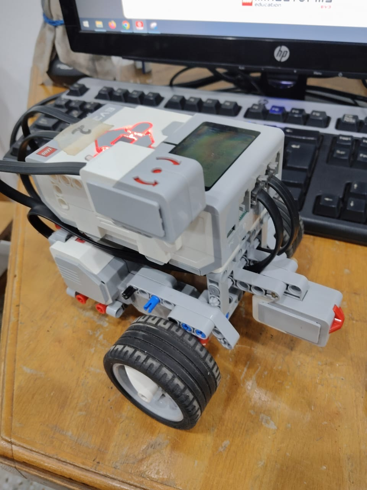
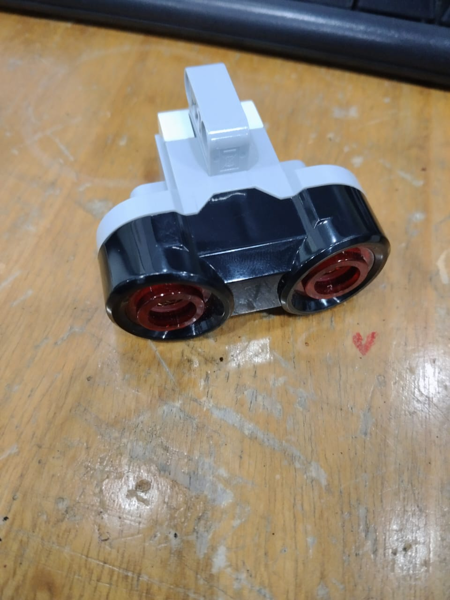
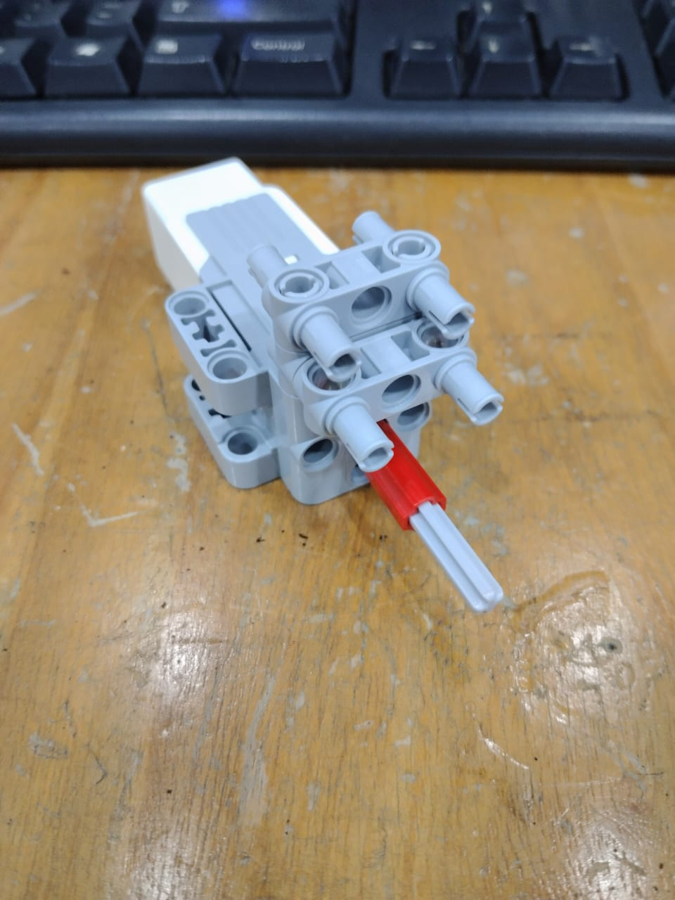
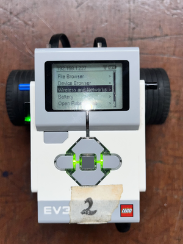
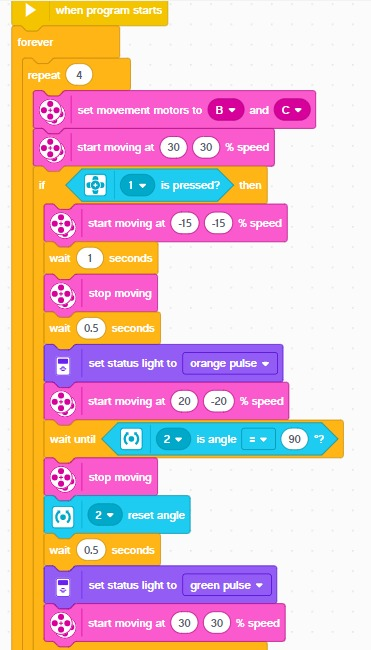

# 👾Laboratorio 1: Conociendo los robots Ev3 Y Kuboki

## 🏁Objetivos

* Familiarizarse con los robots Kuboki y EV3, explorando sus características, herramientas de desarroIlo, sensores. creando un programa simple para controlar los movimientos del robot.
* Modelador un robots movil en software de simulación.
* Crear un programa simple para controlar los movimientos del robot

## 🖌️Estado del Arte

### Que es un robot?

La norma ISO 8373:2021 define un robot como un sistema actuado mecánicamente, programable, con cierto grado de autonomía, que puede percibir su entorno y realizar acciones para alcanzar objetivos específicos. Esta definición reconoce tanto los robots industriales como los robots de servicio, para los cuales     se establece como característica general el tener la capacidad para tomar decisiones y ejecutar tareas sin control humano continuo.

El funcionamiento de un robot basa en cuatro elementos fundamentales. La locomoción le permite desplazarse, utilizando mecanismos como ruedas, orugas o patas, dependiendo del entorno. La percepción la cual le otorga la capacidad de captar y procesar información mediante sensores como cámaras, LIDAR o
ultrasonido. La localización es esencial para que el robot identifique su posición en un espacio determinado, utilizando GPS, mapas digitales o algoritmos de SLAM. Finalmente, la navegación integra todos estos elementos para planificar y ejecutar trayectorias seguras hacia sus objetivos, adaptándose a posibles
obstáculos o cambios en el entorno.

Estas capacidades permiten que los robots se apliquen en múltiples sectores. En la industria manufacturera, realizan tareas repetitivas y de precisión, como soldadura y ensamblaje. En logística, transportan y ordenan mercancía de forma autónoma. En salud, colaboran en cirugías, asistencia y rehabilitación. También destacan en agricultura, exploración espacial, rescate en zonas de riesgo y servicios domésticos como limpieza o vigilancia.

### LEGO Mindstorms EV3

El robot LEGO EV3 es una plataforma robótica que permite la integración de múltiples sensores y actuadores para programar, tareas o rutinas básicas o avanzadas, como estrategias de control, navegación autónoma hasta visión artificial si se le agregan periféricos como cámaras. Este robot tiene un sistema operático basado en Linux y cuenta con un procesador como el ARM9 de 300 MHz, adicional a esto, tiene puertos de comunicación USB, bluetooth y Wifi lo que lo vuelve versátil si se requiere el envío y la toma de datos de forma remota.

<div align="center">
  
</div>

#### Sensores y Actuadores

* Sensor táctil : Detecta contacto físico (presionado / liberado)

<div align="center">
  
</div>
* Sensor Infrarojo : Utiliza las ondas de luz reflejadas por un objeto

<div align="center">
  
</div>

* Sensor de color : Distingue colores (8 distintos), mide intensidad de luz reflejada y ambiental
* Sensor ultrasónico : Mide distancia a objetos (de 3 cm a 250 cm)

<div align="center">
  
</div>

* Giroscópico : Detecta velocidad angular y orientación
* Motor grande con una velocidad angular entre los 160-170 rpm con un torque de rotación de 20 Ncm. Este motor incluye un sensor de rotacion incorporado con resolucion de 1 grado para el control de velocidad.
* Motor mediano con una velocidad de los 240 a 250 rpm y un torque de rotación de 8Ncm.

<div align="center">
  
</div>

#### APIS

* EV3Dev API: Interfaz que permite acceso a sensores, motores, LEDs, botones, desde lenguajes estándar a través del sistema de archivos Linux.
* LEGO SPIKE API: API basada en MicroPython para los nuevos kits como SPIKE Prime (aunque limitada para EV3).
* leJOS API: API Java específica para NXT y EV3 con muchas clases orientadas a robótica.

#### Lenguajes de Programación

* Python: Vía EV3Dev o Pybricks
* Java: Mediante leJOS o EV3Dev.
* C/C++: Soportado en EV3Dev.
* Scratch / Blockly: Programación visual para estudiantes.
* LabVIEW (EV3-G) – Lenguaje gráfico usado en el software oficial LEGO Mindstorms.

### KOBUKI

Al igual que el robot LEGO EV3, el robot Kuoki también es una plataforma robótica que integra múltiples sensores, con la diferencia de que estos últimos son usados principalmente para la navegación y mapeo de entornos. El firmware está diseñado para funcionar con ROS, el cual ofrece paquete y controladores  que permiten la operacion dentro del entorno de ROS, lo que puede facilitar la implementacion de algoritmos para la navegacion, mapeo y control.

#### Sensores y Actuadores

* Sensores de colisión (bumpers): 3 interruptores mecánicos (izquierda, centro, derecha) para detectar impactos frontales.
* Sensores de cliff (precipicio): Detectan bordes o desniveles peligrosos para evitar caídas.
* Giroscopio digital: Mejora la estimación de orientación angular.
* Encoders de rueda: Para cálculo de odometría (posición y velocidad).
* Sensor de caída de ruedas (wheel drop): Detecta si una rueda pierde contacto con el suelo (útil para detectar levantamientos).
* Motores DC: El robot cuenta con motores DC tipo Brushed de un torque que puede llegar hasta un valor de 33mNm con una velocidad de 8800rpm.
* Altavoces: Actuador de audio para emitir sonidos o alertas y con el cual se puede usar varias secuencias de sonidos programables.

#### APIS

* Kobuki node API (ROS): Publica topics como odom, sensor_state, y ofrece servicios para emitir sonidos, controlar LEDs, y movimiento.
* ROS Navigation API: Utiliza la odometría de Kuboki con algoritmos de navegación y planificación de ROS.
* Gazebo plugins API: Para simular a Kuboki en entornos virtuales (uso con ROS y Gazebo).

#### Lenguajes de Programación

* Python: A través de rospy, usado comúnmente para scripts.
* C++: Vía roscpp, recomendado para tareas de control, procesamiento de sensores, navegación.
* Bash: Usado para lanzar nodos, configuraciones (launch files) y automatización de tareas en ROS.

## 🔄️Desarrollo

### Lego Mindstorms EV3

#### Configuración por Python

Para realizar la programación de la rutina mediante python, se realizó la configuración WIFI del robot; para ello se le colocó el modulo de wifi por USB al Lego Mindstorms EV3 y se le connfiguró la red 'LabFabEx'. Al realizar dicho procedimiento la pantalla mostró al dirección IP del robot; como se ve en la siguiente figura



Se puede observar que la dirección IP es 192.168.1.227 con ello en un PC conectado a la misma red se verificó que se pudiera comunicar por medio de *ping*


Una vez verificada la comunicación via WiFi se abrío la consola de comandos del Lego Mindstorms EV3 por medio de SHH con las siguientes credenciales

> **Usuario:** *Robot*

> **Clave:** *Maker*


Con ello se puede a los archivos de la SD que está en el robot y se pueden ejecutar los programas como uno que estaba de ejemplo llamado *pythonHello.py*

```python
#!/usr/bin/env python3

from time import sleep

from ev3dev2.motor import LargeMotor, OUTPUT_B,OUTPUT_C, SpeedPercent, MoveTank
from ev3dev2.sensor import INPUT_1
from ev3dev2.sensor.lego import TouchSensor
from ev3dev2.led import Leds
from ev3dev2.sound import Sound

sound = Sound()
sound.speak('Hello I am a robot')
Leds().set_color("LEFT", "RED")
Leds().set_color("RIGHT", "RED")
sleep(2)
Leds().set_color("LEFT", "GREEN")
Leds().set_color("RIGHT", "GREEN")
sleep(2)


tank_drive = MoveTank(OUTPUT_B, OUTPUT_C)
tank_drive.on_for_rotations(SpeedPercent(25), SpeedPercent(25), 10)

#+end_src
```

Y se ejecuta en el robot, así:


El funcionamiento del codigo se ve en el siguiente video:

https://github.com/user-attachments/assets/963ccdef-cd80-4f55-87f2-be77ee3a0bb2

A partir de dicho codigo, se realizaron modificaciones para realizar la siguiente rutina:

```mermaid
flowchart TD
    A[Inicio] --> G(Activar Motores A y B <br> Sensores 2 y 4)
    G --> W(Emitir sonido de activación <br> Color Ambar en LED)
    W --> E(Contador = 0 <br> Velocidad = 25% <br> Distancia = 0)
    E --> B(Motor A = Velocidad <br> Motor B = Velocidad <br> Color Verde en LED)
    B --> C(Distancia = Sensor 2)
    C --> F{Distancia < 5cm}
    F -->|Sí| M(Contador = Contador + 1) --> J(Motor A = 0 <br> Motor B = 0 <br> Giro = 0&deg)
    J --> H(Motor A = Velocidad <br> Motor B = 0 <br> Color Rojo en LED)
    H --> I(Giro = Sensor 4)
    I --> K{Giro > 90&deg}
    K -->|Sí| L(Motor A = 0 <br> Motor B = 0)
    K -->|No| H
    L --> N{Contador > 4} 
    N -->|No| B
    N -->|Sí| O[Fin]


```



Y el código final fue:

```python
#Libreria para pausas
from time import sleep

#Librerias necesarias para control del robot
from ev3dev2.motor import LargeMotor, OUTPUT_B,OUTPUT_C, SpeedPercent, MoveTank
from ev3dev2.sensor.lego import GyroSensor
from ev3dev2.sensor import INPUT_1
from ev3dev2.sensor.lego import UltrasonicSensor
from ev3dev2.led import Leds
from ev3dev2.sound import Sound

#Variables
contador = 0
velocidad = 35
sound = Sound()

#Inicio de rutina
sound.speak('Ahi te voy San Pedro')
Leds().set_color("LEFT", "AMBER")
Leds().set_color("RIGHT", "AMBER")
sleep(0.5)
sensor = UltrasonicSensor(INPUT_1)
tank_drive = MoveTank(OUTPUT_B, OUTPUT_C)
tank_drive.gyro = GyroSensor()

while contador < 4:
    while sensor.distance_centimeters > 5: #El robot se moverá continuamente hasta encontrar un objeto a menos de 5cm
        tank_drive.on(SpeedPercent(velocidad), SpeedPercent(velocidad))
        Leds().set_color("LEFT", "GREEN")
        Leds().set_color("RIGHT", "GREEN")
    tank_drive.stop()
    Leds().set_color("LEFT", "RED")
    Leds().set_color("RIGHT", "RED")


    #Calibrar el sensor de giro, tomando como posicion actual 0°
    tank_drive.gyro.calibrate()

    #Girar el robot 90° con una velocidad definida
    tank_drive.turn_degrees(
        speed=SpeedPercent(20),
        target_angle=90
    )
  
    contador += 1
```

Y el funcionamiento del robot se ve en el siguiente video:

https://github.com/user-attachments/assets/a3ae271e-b7fb-4779-966c-295972221a82

#### Configuración por bloques

Con base en el diagrama de flujo descrito en la sección anterior, se hizo otra secuencia utilizando el tipo de programación por bloques y se cambió el sensor de distancia por el sensor de contacto. Para la conexión con el programa *EV3 Classroom* se realizó por medio del cable USB.
En la siguiente imangen se muestra el codigo utilizado y el video de demostración

<div align="center">
  
</div>

https://github.com/user-attachments/assets/3dee6be2-c54d-4452-887d-88f93a166c8d

#### Simulacion en CoppeliaSim del robot LEGO EV3

Para el presente laboratorio se simulo el comportamiento del robot Lego EV3 con Copperliasim y Matlab. la trayectoria propuesta es un cuadrado y esta se estructuro en el software matlab y se realizo la conexion con el puerto 19999 de Coppelia. Con respecto al modelo CAD utilizado, se uso el modelo desarrollado por Alberto Martin Dominguez y se configuraron los actuadores (motores) en Matlab. A continuacion se presenta el codigo desarrollado para el movimiento del robot.

```matlab
% Crear la conexión
vrep = remApi('remoteApi');  % Cargar API
vrep.simxFinish(-1);         % Cerrar conexiones previas
clientID = vrep.simxStart('127.0.0.1', 19999, true, true, 5000, 5); % IP, puerto, opciones

if clientID > -1
    vrep.simxSynchronous(clientID,true);
    vrep.simxStartSimulation(clientID,vrep.simx_opmode_oneshot_wait);
    disp('Conexión establecida con CoppeliaSim');
else
    error('No se pudo establecer conexión con CoppeliaSim');
end

% Consulta el handle del objeto Lego_Ev3 en la escena Ev3Mov y lo asigna al handle Ev3_m. 
[returnCode,Ev3_m]=vrep.simxGetObjectHandle(clientID,'lego_ev3',vrep.simx_opmode_blocking);
% Consulta el handle de los motores (Motor_B y Motor_C) en la escena Ev3Mov y lo asigna al handle a cada uno.
[returnCode,Motor_Der]=vrep.simxGetObjectHandle(clientID,'Motor_C',vrep.simx_opmode_blocking);
[returnCode,Motor_Izq]=vrep.simxGetObjectHandle(clientID,'Motor_B',vrep.simx_opmode_blocking);

% [returnCode]=vrep.simxSetJointTargetVelocity(clientID,Motor_Der,1,vrep.simx_opmode_oneshot);
% [returnCode]=vrep.simxSetJointTargetVelocity(clientID,Motor_Izq,1,vrep.simx_opmode_oneshot);
% 
% pause(5.5)
% 
% vrep.simxSetJointTargetVelocity(clientID,Motor_Der,0,vrep.simx_opmode_oneshot);
% vrep.simxSetJointTargetVelocity(clientID,Motor_Izq,0,vrep.simx_opmode_oneshot);

% Parámetros
t_adelante = 5.0;   % segundos para avanzar
t_giro = 1.75;       % segundos para girar 90°
vel_avance = 5.0;   % rad/s para ambos motores
vel_giro = 5.9;     % rad/s en sentido opuesto

for i = 1:4
    % Avanza
    vrep.simxSetJointTargetVelocity(clientID, Motor_Izq, vel_avance, vrep.simx_opmode_oneshot);
    vrep.simxSetJointTargetVelocity(clientID, Motor_Der, vel_avance, vrep.simx_opmode_oneshot);
    pause(t_adelante);

    % Detener
    vrep.simxSetJointTargetVelocity(clientID, Motor_Izq, 0, vrep.simx_opmode_oneshot);
    vrep.simxSetJointTargetVelocity(clientID, Motor_Der, 0, vrep.simx_opmode_oneshot);
    pause(0.5);

    % Giro a la derecha
    vrep.simxSetJointTargetVelocity(clientID, Motor_Izq, -vel_giro, vrep.simx_opmode_oneshot);
    vrep.simxSetJointTargetVelocity(clientID, Motor_Der,  vel_giro, vrep.simx_opmode_oneshot);
    pause(t_giro);

    % Detener
    vrep.simxSetJointTargetVelocity(clientID, Motor_Izq, 0, vrep.simx_opmode_oneshot);
    vrep.simxSetJointTargetVelocity(clientID, Motor_Der, 0, vrep.simx_opmode_oneshot);
    pause(0.5);
end

disp("Recorrido cuadrado finalizado");

disp('Programa terminado')
vrep.delete(); % llama el  destructor!
```

El video que muestra el comportamiento se presenta a continuacion:

https://github.com/user-attachments/assets/99786461-d128-43b0-b146-85b9d83d6fdb

### KOBUKI

#### Manipulación via PC
Elementos necesarios:
**Software**
* Ubuntu 20.04
* ROS Noetic
* Paquetes ROS del robot Kobuki

**Hardware**
* Robot Kobuki
* PC con elementos de software instalados
* Cable de conexión USB tipo B

Procedimiento:
Una vez instalados Ubuntu y ROS se procede a la clonación del repositorio del Kobuki, se conecta el robot al PC por medio del cable USB y una vez verificada la conexión se procede con el lanzamiento de los nodos que realizan el control de velocidad de las ruedas, variando estas velocidades logramos que el robot se mueva en línea recta o haga giros a derecha o izquierda segun se desee.

Al lanzar el nodo aparece la siguiente opción:


Al activar los motores con la opción **e**, el nodo espera que ingresen los comandos de velocidad

Al usar los comandos se modifican las velicidades como se muestra a continuación:


Primero se lanzan los nodos de operación básica del robot


Luego lanzamos el nodo que permite la operación por teclado


Todo el procedimiento se realizó basado en la "**Guías para la interacción con la base Kobuki
bajo el framework ROS (Guía 2 - Introduccion a la base Kobuki)**" de Santiago Daza, Pedro F. Cardenas y Ricardo Ramirez.

Tambien se puede monitorear los sensores del robot mientras este está conectado como se muestra a continuación:


El siguiente video muestra la manipulacion del robot usando la aplicación

https://github.com/user-attachments/assets/ee316dc3-965e-4750-a5a5-cc9fffb9156d

#### Simulacion en CoppeliaSim del robot Kuboki

Al igual que el robot Lego EV3, se simuló una trayectoria cuadrada para el robot kuboki, por lo que el codigo del software Matalab es el mismo que se expuso anteriormente. Por otro lado, el modelo CAD utilizado para el robot kuboki se consiguio en una plataforma libre llamada GabcadLibrary y se configuro sobre el robot "rayo" comartido por los docentes. A continuacion se muestra el video de la simulacin.

https://github.com/user-attachments/assets/c7f1c4a6-c42e-4b24-a01b-a517b564cc1c

## 📖Referencias

* «Python language bindings for ev3dev — python-ev3dev 2.1.0.post1 documentation». Disponible en: [https://ev3dev-lang.readthedocs.io/projects/python-ev3dev/en/stable/index.html](https://ev3dev-lang.readthedocs.io/projects/python-ev3dev/en/stable/index.html)
* International Organization for Standardization, ISO 8373:2021 - Robots and robotic devices — Vocabulary, ISO, 2021. Disponible en: [https://cdn.standards.iteh.ai/samples/75539/1bc8409322eb4922bf680e15901852d2/ISO-8373-2021.pdf](https://cdn.standards.iteh.ai/samples/75539/1bc8409322eb4922bf680e15901852d2/ISO-8373-2021.pdf)
* M. J. Mataric, The Robotics Primer. Cambridge, MA: MIT Press, 2007. Disponible en: [https://pages.ucsd.edu/~ehutchins/cogs8/mataric-primer.pdf](https://pages.ucsd.edu/~ehutchins/cogs8/mataric-primer.pdf)
* LEGO Education, LEGO® MINDSTORMS® Education EV3 Core Set. Disponible en: [https://education.lego.com/en-us/products/lego-mindstorms-education-ev3-core-set-/5003400](https://education.lego.com/en-us/products/lego-mindstorms-education-ev3-core-set-/5003400)

### Archivos CAD

* **Kobuki:** «Free CAD designs, files & 3D models | The GrabCAD Community Library». Disponible en: [https://grabcad.com/library/interbotix-turtlebot-2i-1](https://grabcad.com/library/interbotix-turtlebot-2i-1)
* **LEGO EV3:** «Free CAD designs, files & 3D models | The GrabCAD Community Library». Disponible en: [https://grabcad.com/library/boscobot-ev3-edu-base-1](https://grabcad.com/library/boscobot-ev3-edu-base-1)
