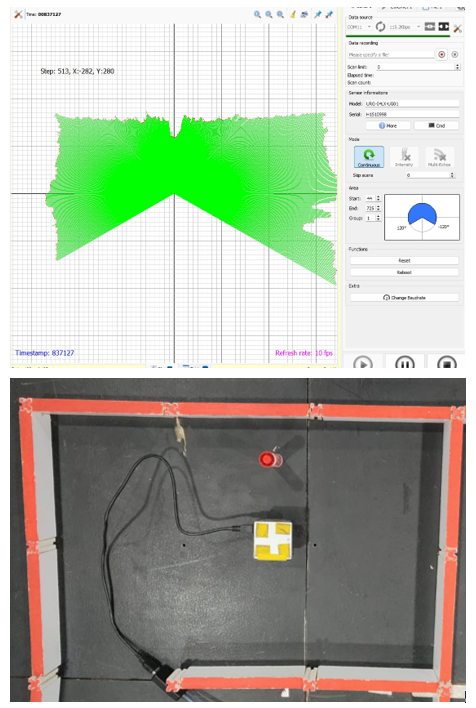

# 🤖Laboratorio 2: Introducción al uso de sensores y ROS

## 🏁Objetivos

## 4. 🔧➡️🚀 Procedimiento

### 4.1. 🔍📚 Búsqueda bibliográfica

1. ¿Qué es el Vocabulario Internacional de Metrología (VIM)?
El Vocabulario Internacional de Metrología es una norma internacional que proporciona definiciones normalizadas para los conceptos fundamentales utilizados en metrología. Su objetivo es unificar el lenguaje técnico en medición para facilitar la comunicación en contextos científicos y en entornos industriales.

2.	Según el VIM, defina los siguientes conceptos:
  * Exactitud de medida: La exactitud de medida se interpreta como la proximidad entre los valores medidos atribuidos al mensurando.
  * Precisión de medida: Se refiere al grado de concordancia entre resultados de mediciones repetidas bajo condiciones específicas. Está relacionada con la repetibilidad y reproducibilidad, pero no necesariamente con la exactitud.
  * Error de medida: Diferencia entre el valor medido y el valor verdadero de una magnitud. Puede ser sistemático o puede ser aleatorio.
  * Incertidumbre de medida Parámetro asociado a una medición que caracteriza la dispersión de los valores atribuibles al mensurando.

3.	Explique la diferencia entre un error sistemático y un error aleatorio.
  * Sistemático: 	Es predecible y constante. Se debe a errores del instrumento o del método. Puede corregirse.
  * Aleatorio: Es impredecible y variable. Se debe a factores no controlados como temperatura o vibraciones. No se puede eliminar, solo minimizar.

4. De acuerdo con la teoría estadística: ¿qué es el valor medio? ¿Qué magnitudes se utilizan para medir la dispersión de los datos?
  * Valor medio: Es el resultado de la suma de todas las mediciones dividida por el número total de mediciones. Representa el valor central de una distribución.
  * Magnitudes para medir la dispersión:
      * Varianza: Promedio de las desviaciones cuadráticas respecto al valor medio.
      * Desviación estándar: Raíz cuadrada de la varianza; indica cuánto se dispersan los valores respecto a la media.
      * Rango: Diferencia entre el valor máximo y el mínimo.
      * Coeficiente de variación: Relación entre la desviación estándar y la media.

7.	Busque una definición de que es ROS y sus principales ventajas
El sistema operativo robótico (ROS) se define como un framework diseñado para el desarrollo de software robótico. ROS no funciona como un sistema operativo independiente, sino como un middleware, que aprovecha sistemas operativos convencionales como Linux y proporciona a los desarrolladores un conjunto de bibliotecas y herramientas para crear aplicaciones robóticas sofisticadas y resistentes.
  * Ventajas de ROS:
     * Arquitectura distribuida basada en nodos.
     * Reutilización de código mediante paquetes.
     * Soporte para múltiples lenguajes (Python, C++).
     * Simulación con Gazebo y visualización con Rviz.
     * Gran comunidad y paquetes disponibles (por ejemplo, navegación, SLAM, visión, etc.).
     * Escalabilidad para robots complejos.
    
6.	Investigue sobre qué comandos se pueden usar con rosnode, rostopic, rosparam, rosservice, rosmsg y rospack.
  * rosnode-> Interactúa con los nodos de ROS. Ej.: rosnode list, rosnode info
  * rostopic-> Trabaja con temas. Ej.: rostopic echo, rostopic pub, rostopic list
  * rosparam-> Administra parámetros del servidor maestro. Ej.: rosparam set/get
  * rosservice-> Llama o inspecciona servicios. Ej.: rosservice list/call
  * rosmsg-> Visualiza estructuras de mensajes. Ej.: rosmsg show
  * rospack-> Busca información sobre paquetes. Ej.: rospack find <paquete>

### 4.2. 👀🫲🏼👂🏼🤖🧠 Sensores

####4.2.1. 🔦👀🌐🔭 Sensor HOKUYO

Para el desarrollo de estas practica se realizo el procedimiento establecido en el repositorio de GithUb, el cual indicaba que se debia verificar la funcionalidad del sensor Hokuyo por medio del software URG Benri data viewing tool. A continuacion se muestra la toma de datos realizada por el sensor con el software.

