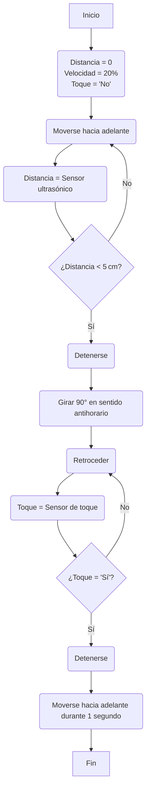

# 🤖Laboratorio 2: Introducción al uso de sensores y ROS

## 🪶Autores

* Andres Camilo Torres Cajamarca
* Juan Camilo Gomez Robayo
* Julian Andres Gonzalez Reina
* Emily Angelica Villanueva Serna
* Elvin Andres Corredor Torres

## Indice de Entregas

[Entrega 1](#entrega-1)

[Entrega 2](#entrega-2)

---
# ENTREGA 1

## 1. 🏁Objetivos

* Familiarizarse con el uso e implementación de sensores.
* Comprender los principios de funcionamiento de diferentes tipos de sensores, así como sus implicaciones en sistemas de adquisición de datos.
* Evaluar la incertidumbre asociada a las mediciones obtenidas mediante sensores, aplicando métodos estadísticos básicos.
* Realizar el manejo de las plataformas robóticas disponibles a través del uso de ROS (Robot Operating System).

## 2. 🔧➡️🚀 Procedimiento

### 2.1. 🔍📚 Búsqueda bibliográfica

1. ¿Qué es el Vocabulario Internacional de Metrología (VIM)?
El Vocabulario Internacional de Metrología es una norma internacional que proporciona definiciones normalizadas para los conceptos fundamentales utilizados en metrología. Su objetivo es unificar el lenguaje técnico en medición para facilitar la comunicación en contextos científicos y en entornos industriales.

2.	Según el VIM, defina los siguientes conceptos:
  * Exactitud de medida: La exactitud de medida se interpreta como la proximidad entre los valores medidos atribuidos al mensurando.
  * Precisión de medida: Se refiere al grado de concordancia entre resultados de mediciones repetidas bajo condiciones específicas. Está relacionada con la repetibilidad y reproducibilidad, pero no necesariamente con la exactitud.
  * Error de medida: Diferencia entre el valor medido y el valor verdadero de una magnitud. Puede ser sistemático o puede ser aleatorio.
  * Incertidumbre de medida Parámetro asociado a una medición que caracteriza la dispersión de los valores atribuibles al mensurando.

3.	Explique la diferencia entre un error sistemático y un error aleatorio.
  * Sistemático: 	Es predecible y constante. Se debe a errores del instrumento o del método. Puede corregirse.
  * Aleatorio: Es impredecible y variable. Se debe a factores no controlados como temperatura o vibraciones. No se puede eliminar, solo minimizar.

4. De acuerdo con la teoría estadística: ¿qué es el valor medio? ¿Qué magnitudes se utilizan para medir la dispersión de los datos?
  * Valor medio: Es el resultado de la suma de todas las mediciones dividida por el número total de mediciones. Representa el valor central de una distribución.
  * Magnitudes para medir la dispersión:
      * Varianza: Promedio de las desviaciones cuadráticas respecto al valor medio.
      * Desviación estándar: Raíz cuadrada de la varianza; indica cuánto se dispersan los valores respecto a la media.
      * Rango: Diferencia entre el valor máximo y el mínimo.
      * Coeficiente de variación: Relación entre la desviación estándar y la media.

7.	Busque una definición de que es ROS y sus principales ventajas
El sistema operativo robótico (ROS) se define como un framework diseñado para el desarrollo de software robótico. ROS no funciona como un sistema operativo independiente, sino como un middleware, que aprovecha sistemas operativos convencionales como Linux y proporciona a los desarrolladores un conjunto de bibliotecas y herramientas para crear aplicaciones robóticas sofisticadas y resistentes.
  * Ventajas de ROS:
     * Arquitectura distribuida basada en nodos.
     * Reutilización de código mediante paquetes.
     * Soporte para múltiples lenguajes (Python, C++).
     * Simulación con Gazebo y visualización con Rviz.
     * Gran comunidad y paquetes disponibles (por ejemplo, navegación, SLAM, visión, etc.).
     * Escalabilidad para robots complejos.
    
6.	Investigue sobre qué comandos se pueden usar con rosnode, rostopic, rosparam, rosservice, rosmsg y rospack.
  * rosnode-> Interactúa con los nodos de ROS. Ej.: rosnode list, rosnode info
  * rostopic-> Trabaja con temas. Ej.: rostopic echo, rostopic pub, rostopic list
  * rosparam-> Administra parámetros del servidor maestro. Ej.: rosparam set/get
  * rosservice-> Llama o inspecciona servicios. Ej.: rosservice list/call
  * rosmsg-> Visualiza estructuras de mensajes. Ej.: rosmsg show
  * rospack-> Busca información sobre paquetes. Ej.: rospack find <paquete>
 7. Investigue acerca del robot TurtleBot2 y su relación con la base Kobuki.
  * TurttleBot2 es un kit de robot de bajo costo con software de codigo abierto cuya esturctura  esta conformado por la base robotica movil Kobuki que cuenta con sensores de deteccion de obstaculos, sensores de odometria y sensores de inclinacion, ademas proporciona energia al sistema esterno , sensores externos , actuadores y otros componentes.

8. ¿Para que sirve los sensores cliff en el Kobuki?
 * Los sensores Cliff en español sensores de precipicio tienen como funcion detectar desniveles o bordes en el suelo , como escaleras para evitar que el robot caiga . En sensor detecta un cambio de nivel , inmediatamente detiene cualquir moviemiento del robot , es un comando que tiene prioridad.
   
9. ¿Como leer un evento de dicho sensor?
 * Cuando el sensor detecta un desnivel , inmediatamente genera un evento , es necesario suscribirse al topico /mobile_base/events/cliff , el cual publica mensajes de tipo kobuki_msgs/CliffEvent , el mensaje tiene los siguientes campos
 * sensor : 0: izquierdo , 1: centro, 2: derecho
 * estado : 0: piso , 1: precipicio
 * bottom : valor analogico de la señal infraroja 
   
10. ¿Qué protocolo de comunicación usa el Lego Ev3 con sus sensores y actuadores?
 * El LEGO EV3 utiliza principalmente el protocolo I²C para comunicarse con sus sensores inteligentes conectados a los puertos 1-4, lo que permite el intercambio digital de datos como distancia, color o rotación. Algunos sensores también pueden usar UART o señales analógicas según el diseño. En cuanto a los actuadores (motores conectados a los puertos A-D), el EV3 emplea señales de PWM para controlar la potencia y dirección, junto con retroalimentación de encoders para medir posición y velocidad. Este sistema de comunicación es propietario y está optimizado para facilitar la conexión automática y segura de módulos LEGO.
 
11. ¿Qué opciones de conexión permiten integrar sensores no nativos al sistema LEGO EV3?
 * El sistema LEGO EV3 permite integrar sensores no nativos mediante los puertos de sensor utilizando protocolos estándar como I²C o UART, siempre que el sensor respete el voltaje y la estructura del conector. También es posible usar el pin de identificación analógica para que el EV3 reconozca el dispositivo. Otra opción es conectar sensores a través de una Raspberry Pi o una placa Arduino, comunicándose con el EV3 por Bluetooth, Wi-Fi o USB, lo que amplía las posibilidades mediante sistemas como ev3dev o entornos de programación como Python o C++.


### 3. 👀🫲🏼👂🏼🤖🧠 Sensores

#### 3.1. 🔦👀🌐🔭 Sensor HOKUYO

Para el desarrollo de estas practica se realizo el procedimiento establecido en el repositorio de GithUb, el cual indicaba que se debia verificar la funcionalidad del sensor Hokuyo por medio del software URG Benri data viewing tool. A continuacion se muestra la toma de datos realizada por el sensor con el software.

Utilizando la funcion de LidaScan se grafica las paredes detectadas por el sensor en un scanedo de 682 grados. Por otro lado, estos mismos datos son utilizados para graficar el mapa de ocupacion que se puede ver en escala de grises.

#### Pose 1 sensor HOKUYO
<div align="center">
 
</div>

#### Pose 2 sensor HOKUYO

<div align="center">
 
</div>

#### Pose 2 sensor HOKUYO

<div align="center">
 
</div>

Finalmente, se realiza el mapa de ocupacion completo, obtenido de cada una de las poses detallando asi el espacio en el que se encuentra el sensor.

<div align="center">
 
</div>

Errores identificados

* Ruido de baja densidad. En la unión de escaneos, hay puntos sueltos o ruido que no pertenece a ninguna superficie clara. Esto esta causado por:
  * Reflexiones en paredes no perfectamente mates.
  * Interferencia con fuentes de luz.
  * Valores atípicos (outliers) no filtrados del LIDAR.
  * Vibración o inestabilidad del sensor durante el escaneo

* Zonas con datos faltantes. El mapa presenta sectores oscuros o sin datos (zonas negras), especialmente hacia los extremos del ángulo de visión. Esto se debe a:
  * Objetos fuera del rango de escaneo, ya que el sensor no detenta en rangos de -120 - 120 grados.
  * Ruido o lecturas nulas del sensor que fueron descartadas.
    
#### 3.2. 🔦👀🌍📡 Sensor RPLIDAR

El sensor RPLidar es un sensor el cual utiliza luz láser para medir distancia a objetos, para esta práctica se hace una adquisición de datos utilizando los algoritmos de python puestos a nuestra disposición en el GitHub de la clase [lidar.py](archivos_matlab/lidar.py), colocando el sensor en tres poses diferentes con el fin de recrear con algoritmos de matlab el laberinto utilizado para las pruebas .

Se utiliza el comando LidarScan de matlab para graficar los datos obtenidos y el comando insertRay para graficar las paredes detectadas por el sensor y simular el láser del sensor [Codigo_LidarScan_BuildMap.m](archivos_matlab/Codigo_LidarScan_BuildMap.m). Finalmente se utiliza el comando buildMap para recrear el espacio completo donde se tomaron los datos. 
Se toma el siguiente marco de referencia fijo para poder colocar las poses, todas las poses están en Metros y radianes  

#### Marco de referencia fijo


<div align="center">
 
</div>

#### Pose 1 [0.62, 0.54, 3/2*pi]

<div align="center">
  
  
</div>

<div align="center">
 
</div>


#### Pose 2 [0.17, 0.32, pi/2]

<div align="center">
 
 
 
</div>


<div align="center">
 
</div>


#### Pose 3 [0.21, 0.42, pi]

<div align="center">
 
 
</div>

<div align="center">
 
</div>

#### Mapa de Ocupacion Completo 

<div align="center">
 
</div>

Errores identificados
* Rangos de Medición
  * El rango de medición de este sensor es de 0.15 metros a 12 metros en algunos casos del experimento el cable de envío de datos quedo muy cerca al sensor, debido a esto en algunas ubicaciones no se pudieron adquirir datos.
  * Al estar en rotación constante la vibración del sensor afecta con la adquisición de datos


#### 3.3. 🔊📡📏 Sensor de ultrasonido

De acuerdo a las instrucciones se realzó el montaje experimental para comprobar la presición del sensor de ultrasonido HC-SR04, se realiza la toma de muestras a 1m, 1,6m y 2,1m. Para cada distancia se realiza la toma de 100 muestras y se calcula el error absoluto, el error relativo, la distancia media y la desviación estandar. 

Montaje experimental realizado
<div align="center">
 
</div>

En la siguiente imagen se muestran las graficas de las mediciones para 100 cm, obteniendo una distancia media de 95.6020 cm, una desviación estandar de 7.6605 
<div align="center">

</div>

A continuación se muestran las graficas de error absoluto y error medio en cada punto
<div align="center">

</div>

En la siguiente imagen se muestran las graficas de las mediciones para 160 cm, obteniendo una distancia media de 156.2359 cm, una desviación estandar de 0.0195 
<div align="center">

</div>

A continuación se muestran las graficas de error absoluto y error medio en cada punto
<div align="center">

</div>

En la siguiente imagen se muestran las graficas de las mediciones para 160 cm, obteniendo una distancia media de 206.0456 cm, una desviación estandar de 0.1886 
<div align="center">

</div>

A continuación se muestran las graficas de error absoluto y error medio en cada punto
<div align="center">

</div>

**Análisis de resultados**
Como se aprecia en las gráficas, en la medida que se incrementó la distancia de medición la desviación estandar disminuyó, es decir la precisión mejoró con la distancía.
En las gráficas se presentan los mejores resultados, sin embargo, se pudo deducir que el sensor es muy susceptible al ruido y perturbaciones.
En la toma de medidas para una distancia de 100 cm, aparecieron longitudes que diferían en más de un 50% del valor real.
La diferencia de la sdistancia media con respecto a la distancia real se mantuvo entre los 4 y 5 cm independientemente de la longitud medida, lo cual nos permite pensar que el sensor mantiene la precición más sin embargo no es confiable con una sola medida, es necesario tener un conjunto de medidas para hacer una buena aproximación al valor real, resaltando que los valores medidos siempre estuvieron por debajo del valor real de distancia.


#### 3.4. 📡🧭🧱 Sensores Lego

##### 3.4.1 ↕️Linea recta

Para el procedimiento con los sensores Lego, empleando el mindstorms ev3, en primer lugar se construyó el siguiente programa [Linea_Recta.mlsp](Archivos_EV3/Linea_Recta.mlsp) en la Aplicación oficial _EV3 Classroom_ para lograr que el robot se moviera en linea recta.

<div align="center">
 
</div>

Este programa, hacia que el robot se moviera en linea recta hasta detectar un objeto a menos de 5 _cm_. Como se puede observar en el siguiente video,


https://github.com/user-attachments/assets/ee291814-7428-4ab5-ab27-86ec813b11f5


Ahora bien, para poder lograr que recorriera aproximadamente 1 metro se tuvo en cuenta que el objeto que iba a lograr que se deteniera estuviera a 105 cm (1.05 m) del extremo del robot. Al finalizar el recorrido, el robot mostraba la distancia inicial y la distancia final medida por el sensor ultrasonido y los grados medidos por cada una de las ruedas considerando 0 cuando empieza el recorrido. Al emplear dicho programa se obtuvo:

<div align="center">
 
</div>

Es decir,

|Dato|Unidad|Descripción|
|----|------|-----------|
|105.2|cm|Distancia inicial del sensor ultrasonico hasta el objeto|
|4.6|cm|Distancia final del sensor ultrasonico hasta el objeto|
|2071|°|Grados del encoder recorridos por rueda derecha|
|2075|°|Grados del encoder recorridos por rueda izquierda|

A apartir de dichos datos, se calculó la distancia recorrida, primero con los datos de cada rueda, para ello, se tiene en cuenta que

$$ P = 2 \cdot \pi \cdot r$$

donde $P$ es el perimeto de la rueda, es decir la distancia que recorre al girar 1 vuelta completa y $r = 0.028 \text{m}$ que es el radio de la rueda. 

$$ P = 2 \cdot \pi \cdot 0.028 = 0.1759 \text{m}$$

Ahora, para hallar la distancia teniendo en cuenta los grados se tiene que 

$$ d = m_{grados} \cdot \frac{P}{360^{o}} $$

y con los datos obtenidos se tiene que 

$$ d_1 =  2071^{o} \cdot \frac{0.1759}{360^{o}} = 1.0121 \text{m}$$
$$ d_2 =  2075^{o} \cdot \frac{0.1759}{360^{o}} = 1.0140 \text{m}$$

obteniendo un promedio de $d_{prom} = 1.0131 \text{m}$ dando un error relativo de $1.31$%

Por el lado, para ver el funcionamiento del sensor ultrasonico, se tiene que

$$ d_u = d_f - d_i = 105.2 - 4.6 =  100.6 \text{cm} = 1.006 \text{m}$$

con ello, se tiene un error relativo de $0.6$%. Colocando los datos en una tabla tenemos que,

|Sensor|Medida obtenida (cm)|Error relativo (%)|
|------|---------------|--------------|
|Ultrasónico|100.6| 0.6 |
|Encoder Rueda| 101.31 | 1.31 |

Con ello se puede decir que el sensor ultrasonico tiene una mayor exactitud que el sensor del encoder de la rueda.

##### 3.4.2 🔄️ Giro en rueda

Para este procedimiento, de igual manera que en la sección [3.4.1 ↕️Linea recta](#341-%EF%B8%8Flinea-recta) se crearon los programas [Giro_30.lmsp](Archivos_EV3/Giro_30.lmsp) y [Giro_45.lmsp](Archivos_EV3/Giro_45.lmsp) en la aplicación _EV3 Classroom_, el codigo en bloques de uno de esos programas se puede ver en la siguiente imagen

<div align="center">
 
</div>

En este programa, el robot gira el Motor conectado al puerto _B_ 30° cada 15 segundos, tiempo suficiente para tomar la medida con un instrumento externo, en este caso con un goniometro, dicho proceimiento se realizó 3 veces, como se observa en las siguientes fotos:

<div style="display: flex; justify-content: center; gap: 10px;">
 
 
 
</div>

Para mejor comprensión, se colocaron los valores en la siguiente tabla

|No. Prueba|Angulo Encoder (°) |Distancia Goniometro (°) |Error relativo (%)|
|------|------|------|------|
|1|30|29|3.45|
|2|60|59|1.69|
|3|90|89|1.12|

Dandonos un error en promedio de $2.08$%

De igual forma se hizo el giro de 45° dando,

<div style="display: flex; justify-content: center; gap: 10px;">
 
 
 
</div>

|No. Prueba|Angulo Encoder (°) |Distancia Goniometro (°) |Error relativo (%)|
|------|------|------|------|
|1|45|45|0|
|2|90|89|1.12|
|3|135|44(Angulo interno)|0.74|

Y con estos datos nos dio un error en promedio de $0.62$%

---
## ENTREGA 2

### 4. 🌐🤖 ROS

#### 4.1. 🗂️🌐🤖 Uso de ROS
Haciendo uso de los dos archivos de python suminsitrados, se procedera a explicar que realiza cada codigo desglosado.

pysubpose.py

Inicialmente le dice al sistema operativo el tipo de interprete que debe usar, en este caso debe usar Python 3.
Luego el programa llama la librería de rospy y también llama a Pose.
A continuación, define una función “poseMessageReceived” que devuelve un “message” en pantalla cada vez que lo obtiene, el cual es la posición X, Y y la Dirección θ del robot. 
Inicia un nodo ROS llamado “pysubpose” y se suscribe al tópico “turtle1/pose” y cada vez que se publica la Pose, va a llamar la función “poseMessageReceived”.
Con la función rospy.spin() mantiene el programa escuchando al tópico, a la espera de mensajes.
Finalmente, con el except maneja una excepción en caso de que se oprima ctrl+c para cerrar el programa.


<div style="display: flex; justify-content: center; gap: 10px;"  align="center">
  
</div>
Publicacion de Pose con pysubposepy

Igual que el programa anterior en su primera línea le dice al sistema operativo el tipo de interprete que debe usar, en este caso debe usar Python 3.
Importa rospy para manejar ROS, twist para manejar la velocidad y random para dar valores aleatorios.
Luego crea un  publicador en el tópico “turtle1/cmd_vel” el cual envía mensajes del tipo Twist y a continuación se inicia un nodo llamado “pypubvel”.
También crea una variable de tasa “rate” la cual enviará valores cada 0,5 segundos.
El bucle While se mantendrá operativo mientras ROS esté activo, dentro de este bucle se crea un mensaje Twist, se asigna valores aleatorios a “msg.linear.x” en el rango [0 - 1] y también a “msg.angular.z” con la fórmula 2*random() – 1 en el rango [-1 - 1].
Luego publica el mensaje y espera hasta el siguiente ciclo.
Finalmente, con el except maneja una excepción en caso de que se oprima ctrl+c para cerrar el programa.

<div style="display: flex; justify-content: center; gap: 10px;" align="center">
 
</div>
Trayectoria Aleatoria de Turtlesim con pypubvel

Haciendo uso de las funciones de ROS *turtlesim_node* y *turtle_teleop_key* movemos la tortuga por el borde del mapa hasta que haya colisión, con la suscripción a turtlesim_node conocemos la posición de la tortuga y procedemos a llevarla por las cuatro esquinas como muestran las siguientes imágenes.
<div style="display: flex; justify-content: center; gap: 10px;" align="center">

</div>
Tortuga totalemente a la derecha
<div style="display: flex; justify-content: center; gap: 10px;" align="center">

</div>
Tortuga en la esquina superior derecha
<div style="display: flex; justify-content: center; gap: 10px;" align="center">

</div>
Tortuga en la esquina superior izquierda
<div style="display: flex; justify-content: center; gap: 10px;" align="center">

</div>
Tortuga en la esquina inferior izquierda
<div style="display: flex; justify-content: center; gap: 10px;" align="center">

</div>
Tortuga en la esquina inferior derecha
Con estos datos el mapa tiene esquinas en:
Superior derecha (11.10902, 0.024874)
Superior izquierda (-0.031119, -0.007457)
Inferior izquierda (-0.025373, 11.108388)
Inferior derecha (11.115529, 11.106618)

Lo que nos da un rango en X de -0.031119 a 11.115529 y un rango en Y de -0.007457 a 11.108388, interpretando esto en un mapa de ancho en X de 11.1466648 y en Y de 11.115845
Servicios en ROS usando Python
Los servicios de ROS pueden ser utilizados con Python a través de rospy, esto llamando un servicio de la forma   rospy.ServiceProxy con el nombre del servicio que querramos llamar, algunas veces es importante hacer uso de  rospy.wait_for_service() para que espere hasta que el servicio esté disponible.
El uso de los servicios es importante cuando se requiere una acción especifica con respuesta inmediata sin necesidad de obtener datos de flujo continuo.
<div style="display: flex; justify-content: center; gap: 10px;" align="center">

</div>
En este caso se ven dos servicios usados, turtle1_teleport=rospy.ServiceProxy('turtle1/teleport_absolute',TeleportAbsolute), el cual permite teletransportar la tortuga a la coordenada deseada con la instrucción 
resp1=turtle1_teleport(X, Y, R), donde X y Y son las coordenadas de la tortuga y R los radianes de rotación de esta.
El otro servicio usado es clear1=rospy.ServiceProxy('clear',Empty), 	el cual permite borrar los trazos generados en pantalla con la instrucción clear1().

Finalmente se desarrolla un programa que crea dos tortugas y una se encarga de dibujar un triangulo, mientras que la otra realiza un cuadrado.
<div style="display: flex; justify-content: center; gap: 10px;" align="center">

</div>
Posicion final de las tortugas con el .launch


#### 4.2. 🌐🐢🤖 ROS Kuboki
Desarrolle un programa que permita realizar la lectura del sensor de acantilado (cliff) del robot Kobuki y reproduzca un sonido al detectarse un evento asociado a dicho sensor. De forma simultánea, habilite el modo de teleoperación mediante teclado para controlar el movimiento del robot.
Usando las librerías propias del robot Kobuki, las cuales fueron instaladas en la carpeta **Kobuki_ws**, dentro del la carpeta Kobuki_nodes, se crea un nuevo nodo llamado **clif.py** que realiza lo siguiente:
1. Declara la variable de sonido que va a reproducir cuando aparezca un evento en el sensor de la rueda "Cliff" y la publica en un tópico
2. Crea el subscriptor para monitorear los eventos que genere el topico **/mobile_base/events/cliff**
3. Crea el publicador que enviará al tópico **/mobile_base/commands/sound** el tipo de sonido que va a reproducir el robot cuando detecte un cambio en el sensor de la rueda

A continuación se pressenta el código elaborado:

[clifh.py](ROS_Kobuki/clifh.py)
    
Además del script es necesario modificar el archivo [CMakeLists.txt](ROS_Kobuki/CMakeLists.txt) como se resalta a continuación:

```python
                 scripts/clifh.py
```

También es necesario modificar el archivo [safe_keyop.launch](ROS_Kobuki/safe_keyop.launch) para que al ejecutarlo lance el nodo escrito que envía el mensaje de alerta. 
A continuacón se resalta la línea de código incluida

```python
<node pkg="kobuki_node" type="clifh.py" name="clifh" output="screen"/>
```

Cabe resaltar que el nodo se creó dentro del nodo principal **kobuki_node**, se escribió en Python y se ejecuta dentro del launch **minimal.launch** para que se ejecute mientras se ejecutan los nodos principales dentro de las librerías de kobuki.

A continuación se presenta un video del funcionamiento del programa realizado 

<div align="center">
  <video src="https://github.com/user-attachments/assets/1ffbfc6b-595a-4826-a535-f70a97c71333" />
</div>


#### 4.3. 🌐🧱🤖 ROS Lego EV3

Para utilizar ROS con el robot Lego Mindstorms EV3, no es posible ejecutarlo directamente en el dispositivo, ya que este no cumple con los requisitos mínimos de hardware necesarios para correr ROS. Por esta razón, se recurre a técnicas que permiten conectar el EV3 a un sistema ROS que se ejecuta en un PC.

Una de estas técnicas consiste en establecer una comunicación mediante sockets a través de un programa en Python. Este programa permite configurar el robot como un sistema de entrada/salida (I/O), lo que posibilita la lectura de sensores y el envío de comandos a los actuadores a través de la red.

En paralelo, un nodo de ROS en el PC se comunica por red con el EV3 para llevar a cabo el control del robot. El programa desarrollado para este fin fue [server.py](ROS_EV3/Conexion/server.py), el cual, al ejecutarse en el EV3, muestra la siguiente salida:

<div align="center">
  
</div>

Una vez establecida la conexión de red con el robot, es posible proceder con los siguientes puntos del laboratorio.

1.1. Lectura de sensores

Una vez establecida la comunicación con el robot, se realizaron las modificaciones correspondientes al programa [lectura_sensores.py](ROS_EV3/Sensores/lectura_sensores.py). Paralelamente, se desarrolló un nodo de ROS con un script en Python denominado [ev3_sensores_server.py](ROS_EV3/Sensores/src/ev3_bridge/scripts/ev3_sensor_server.py).

En términos generales, el EV3 envía periódicamente (cada 0.1 segundos) los datos obtenidos por sus sensores a través de la red. El nodo de ROS recibe esta información mediante un socket, y posteriormente la publica en el tópico *ev3/sensors*.

El funcionamiento de este sistema puede observarse en el siguiente video:

<div align="center">
  <video src="https://github.com/user-attachments/assets/e30f26e1-afbb-4691-a426-1fa7a410a9a8" />
</div>

1.2. GUI teleoperacion

Para la teleoperación del EV3, se utilizó el programa [ev3_teleop_server.py](ROS_EV3/Teleoperacion/ev3_teleop_server.py) y el nodo de ROS [ev3_teleop_client.py](ROS_EV3/Teleoperacion/ev3_teleop/scripts/ev3_teleop_client.py). Con estos programas, se implementaron las siguientes funcionalidades mediante el uso del teclado, controlando los motores del robot a un X % de su velocidad máxima:

* *W* avanzar
* *S* retroceder
* *A* giro a la izquierda
* *D* giro a la derecha
* *Q* detenerse

Una vez implementado el sistema, su funcionamiento puede observarse en el siguiente video:

<div align="center">
  <video src="https://github.com/user-attachments/assets/9b275ff9-4d78-4021-bb49-469876914db3" />
</div>


2. Rutina

Para generar la rutina se siguió el siguiente diagrama de flujo


```mermaid
graph TD
    A[Inicio] --> B(Distancia = 0<br>Velocidad = 20%<br>Toque = 'No') --> C(Moverse hacia adelante)
    C --> D(Distancia = Sensor ultrasónico)
    D --> E{¿Distancia < 5 cm?}
    E -- Sí --> F(Detenerse)
    E -- No --> C
    F --> G(Girar 90° en sentido antihorario)
    G --> H(Retroceder)
    H --> I(Toque = Sensor de toque)
    I --> J{¿Toque = 'Sí'?}
    J -- Sí --> K(Detenerse)
    J -- No --> H
    K --> L(Moverse hacia adelante durante 1 segundo)
    L --> M[Fin]
```

Para la implementación, se utilizaron dos nodos de ROS:

* [EV3_Bridge](ROS_EV3/Rutina/src/EV3_Bridge/scripts/ev3_socket_bridge.py): Nodo encargado de la comunicación con el robot. Se encarga de leer los datos de los sensores y enviar comandos a los actuadores a través de la red.
* [EV3_instruction](ROS_EV3/Rutina/src/EV3_Instruction/scripts/ev3_instruction_node.py): Nodo de control de movimiento. Este nodo procesa los datos publicados en el tópico *ev3/sensors* y, según las condiciones dadas, publica comandos de control en el tópico *ev3/instructions*.

Adicionalmente, se empleó un script en Python ([ev3_client.py](ROS_EV3/Rutina/ev3_client.py) ejecutado directamente en el EV3. Este programa se encarga de enviar los datos de los sensores y ejecutar las órdenes recibidas para controlar los actuadores.

El funcionamiento completo del sistema puede observarse en el siguiente video:

<div align="center">
  <video src="https://github.com/user-attachments/assets/fa0089ac-f7b5-402b-9dd7-5a6d1e279d06" />
</div>


# 5. 🪶 Referencias

* V. Mazzari, «I2C communication: Lego Mindstorms NXT brick, sonar sensor and a Saleae logic analyser», Génération Robots - Blog, 23 de febrero de 2023. Disponible en: https://www.generationrobots.com/blog/en/i2c-communication-lego-mindstorms-nxt-brick-sonar-sensor-and-a-saleae-logic-analyser/?srsltid=AfmBOoof5rZjMT62RZPMTAu3v9xz6ochArpMappM3TvVxX7Lxs3yxEUz
* ev3dev.org, «Input / Output Ports — ev3dev-jessie Linux kernel drivers 19 documentation». Disponible en: https://docs.ev3dev.org/projects/lego-linux-drivers/en/ev3dev-jessie/ports.html
* python.org, «HOW TO - Programación con sockets», Python Documentation. Disponible en: https://docs.python.org/es/3.13/howto/sockets.html
