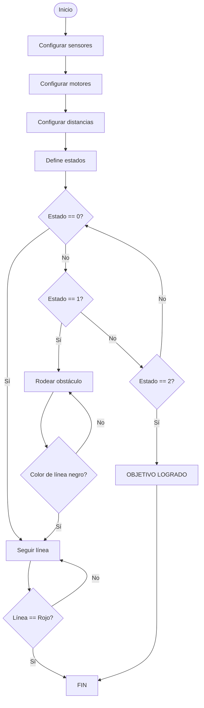

# 🤖Laboratorio 3: Introducción a la navegación con robots

## 🪶Autores

* Andres Camilo Torres Cajamarca
* Juan Camilo Gomez Robayo
* Julian Andres Gonzalez Reina
* Emily Angelica Villanueva Serna
* Elvin Andres Corredor Torres

## 1. 🏁Objetivos

* Identificar las características de los distintos tipos de navegación.
* Reconocer los algoritmos de tipo BUG y los algoritmos de resolución de laberintos.
* Aplicar al menos dos algoritmos basados en comportamientos.

## 2. 🔧➡️🚀 Procedimiento

### 2.1. 🔍📚 Búsqueda bibliográfica

1. Menciona al menos dos características de la navegación planeada y de la navegación basada en comportamientos, y cómo influyen en el tipo de respuesta del robot.

Navegación planeada: En la navegación planeada se conoce el mapa de antemano, por lo que la trayectoria a realizar también es precalculada, esto permite la optimización de la trayectoria al configurar las distancias conocidas y una velocidad adecuada para la solución de la tarea.
Navegación basada en comportamientos: En este tipo de navegación el robot no conoce el mapa y actúa de acuerdo con la información obtenida de los sensores, esta respuesta debe ser rápida para poder reaccionar de acuerdo con el entorno, en este caso se generan las trayectorias mientras evade los obstáculos del entorno y actualiza en tiempo real.

2. Investigaciones destacadas y robots desarrollados por los robotistas Rodney Brooks y Mark Tilden (máximo dos párrafos de cada uno).

Rodney Brooks
Avanzando en el campo de la inteligencia artificial aplicada y ciencias de la computación en diversas universidades como la de Carnegie Mellon, MIT o Queensland University of Technology. Ha desarrollado robots como la aspiradora Roomba, robot hexápodo Genghis, robot de movimiento autónomo Ryder, brazos robóticos como Reacher, etc.

[Rodney Brooks Home](https://people.csail.mit.edu/brooks/)
[Home - Rethink Robotics](https://rethinkrobotics.com/)

Mark Tilden
En el campo de la robótica ha diseñado o desarrollado diversos tipos de robots B.E.A.M. (Biology Electronics Asthetics Mechanics) estos están diseñados con circuitos analógicos de manera que se mantienen lo mas simple posibles al no integrar microcontroladores, haciendolos de igual manera menos adaptativos. Tambien es conocido por desarrollar el robot robosapien un robot de entretenimiento con un movimiento fluido y variedad de gestos, así como también el robot Femisapien 

[BEAM Robotics - Robohub](https://robohub.org/robots-beam-robotics/)
[WowWee Robosapien X](https://wowwee.com/robosapien-x/)

3. Mencione al menos tres algoritmos de planificación de rutas para espacios con obstáculos.

  - Tetha*
  - A*
  - D*
  - D* Enfocado
En el siguiente video una aplicacion del algoritmo A* en los videojuegos

  

  
5. Describa brevemente los algoritmos Bug 0, Bug 1 y Bug 2.
   
Un algoritmo Bug es un tipo de algoritmo de planeacion de movimiento usado en robotica , particularmente para la navegacion de robots mobiles en ambientes con obstaculos desconocidos
  - Bug 0 : Es el algoritmo bug mas sencillo y consiste en seguir el borde del obstaculo hasta que encuentre una ruta disponible a la cual llegar, sin embargo este algoritmo puede fallar en escenarios donde el robot encuentra obstaculos donde requiera un movimiento de retroceso. 
  - Bug 1 : A diferencia del algoritmo Bug 0, este algoritmo garantiza que si existe una ruta hasta la meta el robot la alcanzará y consiste en seguir completamente el borde del obstaculo registrando el punto mas cercano entre el objeto y la meta. Al momento de encontrar el punto sigue su camino hacia la meta.
  - Bug 2 : Este algoritmo es el mas eficiente de todos gracias a su capacidad de minimizar desvios innecesarios. Su funcionamiento es similar a los dos algoritmos anteriores, pero su diferencia es que este algoritmo traza una linea recta entre el inicio y la meta, esta linea es seguida por el robot hasta que encuentra un obstaculo, el robot sigue el borde del obstaculo hasta que vuelve a encontrar la linea para posteriormente seguirla hasta llegar a la meta.
 
6. Describa al menos un algoritmo de solución de laberintos (maze algorithm) aplicado en robótica móvil.
   
Uno de los algoritmos mas utilizados para la solución de laberintos es el algoritmo A*, sus principales ventajas es que siempre encuentra rutas optimas si las heuristicas son apropiadas y se ajusta segun los movimientos permitidos , tambien es capaz de de penalizar giros si se agregan a la funcion de costo, este algoritmo como se menciona anteriormente utiliza heuristicas para encontrar la ruta mas corta hasta la meta, considerando la distancia recorrida y una estimacion del camino restante. Este algoritmo modela el laberinto como un grafo donde cada nodo es una posicion y las aristas corresponden a los posibles movimientos cercanos .

La funcion de costo , esta compuesta por f(n)=g(n)+h(n) donde g(n) hace referencia al costo acumulado desde el inicio hasta el nodo (n) , h(n) es la estimacion heuristica del costo restante hasta la meta . Luego se hace un proceso iterativo con el nodo inicial, en cada paso se extrae el nodo menor, se expanden generando sus vecinos y se actualizan g y f . El proceso iterativo finaliza hasta alcanzar una meta.

### 2.2. 🏎️↪️🧱 Misión 1: Evite los obstáculos
Para la primera misión se implementó un algoritmo bug 2 con python mediante conexion SSH al robot lego EV3 .
En el siguiente diagrama de flujo se plantea el algorítmo de navegación:

El funcionamiento es el siguiente :

    INICIO
    
    CONFIGURAR sensores:
        - Sensor de color en el puerto INPUT_2
        - Sensor ultrasónico en INPUT_4
        - Sensor infrarrojo en INPUT_3
    
    CONFIGURAR motores:
        - Motor izquierdo en OUTPUT_B
        - Motor derecho en OUTPUT_C
    
    DEFINIR parámetros de navegación:
        - UMBRAL_ULTRA ← 6.0 cm
        - UMBRAL_IR ← 10.0 mm
        - V_AVANCE ← 30 (velocidad %)
        - T_CORREC ← 0.05 s
        - MAX_SEARCH_SEC ← 2.0 s
    
    DEFINIR estados:
        - FOLLOW_LINE ← 0
        - BOUNDARY_FOLLOW ← 1
        - OBJETIVO_ALCANZADO ← 2
    
    estado ← FOLLOW_LINE
    
    MOSTRAR "Iniciando navegación..."
    
    MIENTRAS verdadero HACER:

    LEER color del suelo (cs.color)
    LEER distancia ultrasónica (us)
    LEER proximidad infrarroja (ir)

    SI color detectado es NEGRO ENTONCES
        estado ← FOLLOW_LINE

    dist_prev ← 100
    dist_curr ← 99

    --- ESTADO: FOLLOW_LINE ---
    SI estado = FOLLOW_LINE ENTONCES
        MOSTRAR color leído

        SI obstáculo al frente (dist_us < UMBRAL_ULTRA) ENTONCES
            estado ← BOUNDARY_FOLLOW

        SINO SI pierde la línea y no hay obstáculo ENTONCES
            INICIAR temporizador

            MIENTRAS no ve la línea Y tiempo < MAX_SEARCH_SEC HACER
                GIRAR levemente a la izquierda

            SI aún no ve la línea ENTONCES
                GIRAR a la derecha hasta encontrar línea

            estado ← FOLLOW_LINE

        SINO
            AVANZAR recto

        SI color detectado es VERDE (color = 5) ENTONCES
            estado ← OBJETIVO_ALCANZADO

    --- ESTADO: BOUNDARY_FOLLOW ---
    SI estado = BOUNDARY_FOLLOW ENTONCES
        MOSTRAR "Entró a estado BOUNDARY_FOLLOW"

        MIENTRAS obstáculo frontal detectado (dist_us < 30) HACER
            GIRAR suavemente a la derecha hasta despejar obstáculo

        DETENER motores

        MIENTRAS ir.proximity aumenta (dist_prev - dist_curr > 0) HACER
            GIRAR para quedar paralelo al obstáculo
            ACTUALIZAR distancias

        MIENTRAS infrarrojo detecte obstáculo (dist_curr < 50) Y no ve línea ENTONCES
            MOSTRAR distancia IR y color

            SI muy cerca del obstáculo (dist_curr < 4) ENTONCES
                ALEJARSE girando a la derecha

            SI muy lejos del obstáculo (dist_curr > 10) ENTONCES
                ACERCARSE girando a la izquierda

            AVANZAR recto
            ACTUALIZAR dist_curr

        DETENER motores
        estado ← FOLLOW_LINE

    --- ESTADO: OBJETIVO_ALCANZADO ---
    SI estado = OBJETIVO_ALCANZADO ENTONCES
        DETENER motores
        MOSTRAR "Objetivo Alcanzado!!!"
        SALIR del bucle

    MANEJAR interrupción por teclado:
        DETENER motores
    
    MOSTRAR "Navegación finalizada."
    FIN
    

El resultado del cumplimiento de la misión se puede ver en el siguiente video

<a href="https://youtu.be/EMmH6wIEKpY">
" width="<Algoritmo Bug 2>">
</a>

### 2.3. 🏎️🔀🏁 Misión 2: Supere el laberinto
Para el desarrolo del algoritmo maze se implementaron dos tecnicas de programación :

La primer tecnica fue un seguidor de pared izquierda programado mediante la programación de bloques EV3, con la siguiente configuracion de sensores.

  
  

La programacion de los sensores y del robot se detalla a continuacion.
Iniciamos determinando los motores del robot y llevando a 0 los valores de los sensores de giro y de motores, además declaramos una variable para la distancia máxima del muro.

A continuacion ubicamos un bucle para que siempre esté verificando los sensores y de una respuesta dependiendo de este, en el primer bloque tenemos el giro a la izquierda, en donde el sensor de ultrasonido verifica que no haya muro y que tampoco esté activado el sensor de toque. 

La segunda condición es que continue hacia adelante mientras la distncia del sensor no sea mayor a la determinada.

Finalmente cuando el sensor de toque es activado y además el ultrasonido sabe que tiene pared a la izquierda, se interpreta que debe haber un giro a la derecha, como el sensor de toque está activado es necesario retroceder y luego dar el giro.

En el siguiente video una demostracion del codigo en funcionamiento.

  

La segunda tecnica fue el uso de python utilizando la conexión SSH del robot EV3 . Para esta implementación se utilizo la siguiente configuración del robot 

  
  

A continuación se hace la explicación del código utilizado

    INICIO

    CONFIGURAR sensores:
      - Sensor ultrasónico en INPUT_4
      - Sensor infrarrojo en INPUT_3

    CONFIGURAR motores:
        - Motor izquierdo en OUTPUT_B
        - Motor derecho en OUTPUT_C

    DEFINIR parámetros:
      - UMBRAL_ULTRA = 6 cm
      - V_AVANCE = 30 % velocidad
      - T_CORREC = 0.05 segundos
      - MAX_SEARCH_SEC = 2.0 segundos

    DEFINIR estados:
      - BOUNDARY_FOLLOW = 1
      - GOAL_REACHED = 2

    estado ← BOUNDARY_FOLLOW
    distancia_actual ← 99
    distancia_anterior ← 100
  
    MOSTRAR "Iniciando navegación"

    MIENTRAS verdadero HACER
      LEER distancia ultrasónica (dist_us)
      LEER proximidad infrarroja (dist_ir)

    SI estado = BOUNDARY_FOLLOW ENTONCES
        MOSTRAR "Entrando a estado: BOUNDARY_FOLLOW"

        # Caso 1: Si obstáculo al frente
        MIENTRAS distancia ultrasónica < 30 HACER
            GIRAR a la derecha lentamente
            ESPERAR T_CORREC segundos
            ACTUALIZAR distancia ultrasónica
        DETENER motores

        # Caso 2: Alinear usando el sensor infrarrojo
        MIENTRAS distancia_anterior - distancia_actual > 0 HACER
            GIRAR suavemente hacia la derecha
            ESPERAR 0.1 segundos
            ACTUALIZAR distancia_anterior ← distancia_actual
            LEER nueva distancia_actual desde infrarrojo
            MOSTRAR valores actuales

        # Caso 3: Seguir borde mientras no haya obstáculo al frente y esté cerca del borde
        MIENTRAS distancia_infrarroja < 20 Y distancia_ultrasonica > 5 HACER
            MOSTRAR "Siguiendo borde..."

            SI demasiado cerca del borde ENTONCES
                GIRAR un poco a la derecha
            SINO SI demasiado lejos del borde ENTONCES
                GIRAR un poco a la izquierda
            SINO
                AVANZAR recto

            ACTUALIZAR distancias (ultrasónico e infrarrojo)

        # Caso 4: Buscar nuevo borde (girar suavemente)
        MIENTRAS distancia_infrarroja > 6 Y distancia_ultrasonica > 5 HACER
            GIRAR ligeramente a la izquierda
            LEER distancias
            MOSTRAR "Girando a izquierda..."

        DETENER motores

    SI estado = GOAL_REACHED ENTONCES
        DETENER motores
        MOSTRAR "Objetivo alcanzado"
        SALIR del bucle

    #MANEJAR interrupción por teclado:
        DETENER motores

    MOSTRAR "Navegación finalizada"
    FIN

En el siguiente video esta la demostración de la solución del laberinto 

<a href="https://youtu.be/yiLoG67B8KI">
" width="<Algoritmo Bug 2>">
</a>

## 📖Referencias

* «Robot Proving Grounds». Disponible en: https://existentialrobotics.org/RobotProvingGrounds/algorithms/planning
* «Robot Motion Planning: Bug Algorithms» . Disponible en : https://medium.com/%40sefakurtipek/robot-motion-planning-bug-algorithms-34cf5175ab39

